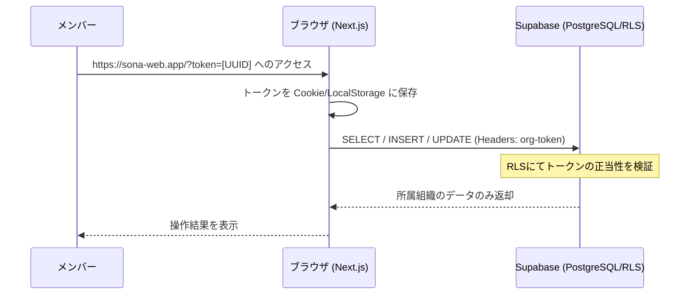

# Sona-Web 認証・共有アクセス設計書

Sona-Suite の管理コンソールである Sona-Web において、組織内のメンバーが円滑に共同作業を行うための「共有アクセストークン」方式の設計を定義します。

## 1. 概要
本設計は、厳格な個人認証（Email/Password）と、運用の利便性が高い共有アクセスの中間を採用し、組織ごとに発行される推測不可能なトークン（UUID）を用いてアクセス制御を行います。

## 2. アーキテクチャ

### 2.1 認証フロー
メンバーは組織の「共有URL」にアクセスすることで、自動的に認証が完了し、ダッシュボードの全機能を利用可能になります。

### 2.2 データ保護 (Row Level Security)
Supabase の RLS を活用し、リクエストに付随するトークンが `organizations` テーブルの `access_token` と一致する場合にのみ、該当する `org_id` を持つ行へのアクセスを許可します。

これにより、URLトークンが漏洩しない限り、他組織のデータが混ざることはありません。

## 3. データベース設計 (追加)

### 3.1 `organizations` テーブルの拡張
既存のテーブルに、アクセス制御用の秘密鍵カラムを追加します。

| カラム名 | 型 | 説明 |
| :--- | :--- | :--- |
| `access_token` | UUID | 組織固有の共有アクセスキー (DEFAULT: gen_random_uuid()) |

## 4. セキュリティー要件

### 4.1 トークンの性質
- **不推測性**: 順序性のある数値 ID ではなく、ランダムな UUIDv4 を採用し、総当たり攻撃を防止します。
- **共有範囲**: 組織内の信頼できるメンバー間での共有を想定します。

### 4.2 権限レベル
現在の要件に基づき、トークン所持者は以下の全操作を許可されます。
- **話者 (`speakers`)**: 閲覧・登録・編集・削除
- **セッション (`sessions`)**: 作成・更新・削除・閲覧
- **テンプレート (`excel_templates`)**: アップロード・マッピング定義・閲覧

> [!TIP]
> 将来的に、管理者（削除可）と一般（登録のみ）などの権限分離が必要になった場合は、トークンを2種類発行するか、Supabase Auth による個人アカウント管理へ移行可能な設計としています。

## 5. UI/UX 仕様

### 5.1 ゲートウェイ
トークンを持たずにトップページにアクセスした場合、以下の挙動となります。
1. **トークン入力画面**: 組織から受け取ったトークンを入力するフォームを表示します。
2. **バリデーション**: 入力されたトークンが有効であれば、ダッシュボードへ遷移します。

### 5.2 共有機能
ダッシュボード内に「この組織の共有URLをコピー」ボタンを配置し、他のメンバーが即座に参加できるようにします。
