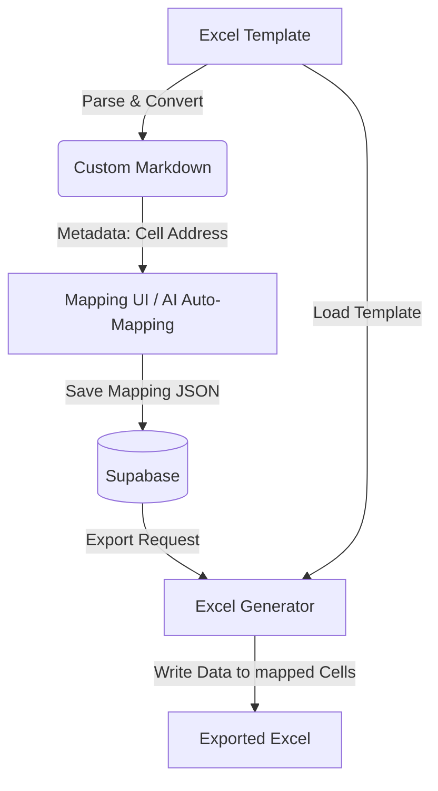

# 07. エクセルマッピング機能の刷新 (Markdown Hybrid Architecture)

## 1. 概要
本ドキュメントでは、`sona-web` におけるエクセル出力マッピング機能の設計を刷新し、Markdown を中間。表現として活用する「ハイブリッド・マッピング方式」について記述する。

## 2. 現状の課題
- **実装の複雑性**: `ExcelJS` とカスタムグリッドコンポーネントによる視覚的範囲指定は、メンテナンスコストが高く、ブラウザの負荷も大きい。
- **AIとの親和性**: バイナリ形式のエクセル構造を LLM が直接理解することは困難であり、自動マッピングの実装に多大な前処理が必要。
- **柔軟性の欠如**: モバイル端末等でのマッピング設定が困難。

## 3. 解決策：ハイブリッド・マッピング方式
物理的な位置情報（セル番地）を保持しつつ、論理的なインターフェースとして Markdown を採用する。

### 3.1 アーキテクチャ図


### 3.2 データ構造
Markdown の各要素（セル）にメタデータとして元のセル番地を埋め込む。

```markdown
| { "addr": "A1" } 議題 | { "addr": "B1" } 内容 | { "addr": "C1" } 発言者 |
| :--- | :--- | :--- |
| { "addr": "A2" } {{title}} | { "addr": "B2" } {{content}} | { "addr": "C2" } {{speaker}} |
```

### 3.3 コンポーネント設計
1. **Excel-Markdown Parser**: `xlsx` または `ExcelJS` を使用し、スタイル情報を削ぎ落とした論理構造を抽出。
2. **Markdown Mapping Editor**:
   - プレーンな Markdown テーブルとして表示。
   - ユーザーが選択した「枠」が、実際にはどのセル範囲に対応するかを JSON で管理。
3. **Template Engine**: 最終的な書き出し時に、テンプレートエクセルの書式を維持したまま、指定されたセルにデータを流し込む。

## 4. メリット
- **AI 自動マッピングの容易化**: Markdown 形式であれば、LLM が構造を即座に理解し、最適なマッピングを提案できる。
- **UX の向上**: 表計算ソフトに近い操作性ではなく、ドキュメント編集に近い操作感を提供。
- **可搬性**: 保存されたマッピング JSON は、エクセル以外のフォーマット（スプレッドシート等）への応用も容易。

## 5. 実装上の留意点
- **結合セルの扱い**: Markdown テーブルでは標準的に結合セルが表現できないため、メタデータに `rowspan` / `colspan` 情報を含める必要がある。
- **テンプレートの更新**: エクセル側で列の挿入などが行われた場合、Markdown 上のセル番地との不整合が発生するため、ハッシュ値等による整合性チェックを推奨。
