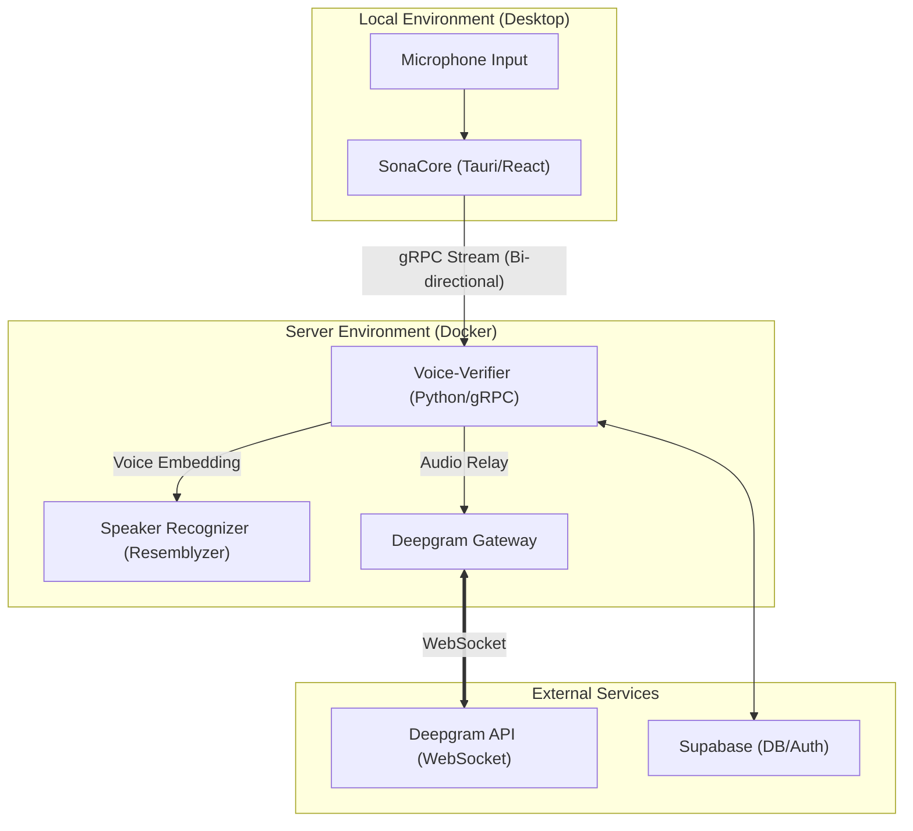

# Project: Sona-Suite System Design (v2)

## 1. プロジェクト概要
リアルタイムでの議事録作成を支援する、デスクトップアプリケーション（SonaCore）とインテリジェントな音声処理バックエンド（Voice-Verifier）からなるシステム。
Deepgram Nova-2 を基盤とした高性能な音声認識に加え、Resemblyzer による独自の話者識別を統合し、誰が何を話したかを正確に記録する。

## 2. システムアーキテクチャ

システムは以下の主要コンポーネントで構成される：

### ① SonaCore (Desktop Application)
ユーザーが直接操作するフロントエンド。
- **技術スタック**: Tauri, React, TypeScript, Vite
- **役割**:
    - 音声デバイス（マイク）からのキャプチャ。
    - 議事録のリアルタイム・プレビュー（Markdown形式）。
    - ミニモード（オーバーレイ）による省スペース表示。
    - 音声データの gRPC ストリーミング送信。

### ② Voice-Verifier (Backend Service)
音声処理のコア・ロジックを担う。
- **技術スタック**: Python (asyncio), gRPC, Deepgram SDK, Resemblyzer, Supabase Python Client
- **主要モジュール**:
    - **`DeepgramGateway`**: gRPC ストリームを Deepgram WebSocket へブリッジ。マルチチャンネル音声のモノラル化、16kHzへのサンプリングレート変換等の正規化も担当。
    - **`SpeakerRecognizer`**: Resemblyzer (VoiceEncoder) を使用し、音声データから声紋（Embedding）を抽出。
    - **`SupabaseManager`**: 話者プロファイル（Embeddingデータ含む）およびセッション情報の管理。
- **処理フロー**:
    1. クライアントから gRPC で音声データを受信。
    2. 音声を Deepgram に送信しつつ、一定量（約2秒）バッファリング。
    3. バッファから話者 Embedding を作成し、Supabase に登録された既存話者と照合。
    4. Deepgram から返却された話者タグ（`speaker_0`等）を、識別された個人名に紐付け。
    5. 最終的なテキストと話者名を gRPC でクライアントへ返却。

### ③ Supabase (Database)
各データの永続化。
- **役割**:
    - `speakers`: 話者名、声紋ベクトル（Embedding）の保存。
    - `sessions`: 会議セッション ID、参加者リストの管理。

---

## 3. 技術的詳細 (Technical Implementation)

### 🔊 音声正規化 (Normalization)
Windows 環境等の多様な接続デバイスに対応するため、Voice-Verifier 入力時に以下の正規化を行う：
- **チャンネル**: ステレオ/マルチチャンネル → モノラル (`audioop.tomono` 等を使用)
- **サンプリング**: 入力レート → 16,000Hz (Deepgram Nova-2 最適値)
- **エンコーディング**: Linear16 (16-bit PCM)

### 🧠 話者識別 (Speaker Identification)
Deepgram の Diarization 機能（話者の切り替わり検知）と、Resemblyzer による Identification（特定の個人の特定）を組み合わせたハイブリッド方式：
- **Step 1**: Deepgram が「話者 A」「話者 B」のようにタグ付け。
- **Step 2**: Voice-Verifier が「話者 A」の音声区間から特徴量を抽出。
- **Step 3**: Supabase 内の声紋データベースと照合（Cosine Similarity）。
- **Step 4**: 一致した場合、以降のセッション内では「話者 A」を具体的な実名に変換。

---

## 4. 外部API仕様
### Deepgram API (Nova-2)
- **Model**: `nova-2-general`
- **Options**: `diarize=true`, `interim_results=true`, `smart_format=true`, `language=ja`

---

## 5. ロードマップ (Evolution)
1.  [x] **Gateway-Construction**: gRPC ⇔ Deepgram 間のストリーミング確立。
2.  [x] **Normalization-Pipeline**: 多彩な音声入力に対する堅牢な正規化処理。
3.  [x] **Basic-Identity-Mapping**: Supabase 連携と簡単な話者識別。
4.  [/] **Speaker-Recognition-Refining**: 識別の精度向上と非同期処理の最適化。
5.  [ ] **Excel-Export-Integration**: Dashboard 経由のテンプレート書き出し。
