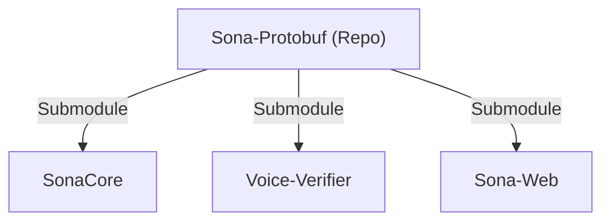

# Sona-Web (管理ダッシュボード) 設計青写真

## 1. 開発環境・構成
- **技術スタック**: Next.js (App Router), Tailwind CSS, Supabase (Auth/DB/Storage)
- **リポジトリ戦略**: 
    - **ポリレポ + Git Submodule**
    - `Sona-Protobuf` リポジトリを新設し、共通の `.proto` ファイルを管理。
    - 各コンポーネントから submodule として参照する。

## 2. Git Submodule による Proto 管理戦略

共通の通信定義 (`.proto`) を確実に同期させるため、以下のフローで管理します。

### ① 構成図


### ② セットアップ手順
1. **中央リポジトリ作成**: `Sona-Protobuf` という名前で空のリポジトリを作成し、`audio_service.proto` を配置。
2. **サブモジュールの追加**: 各プロジェクトのルートで以下を実行。
   ```bash
   git submodule add <Sona-Protobuf-URL> protos/shared
   ```
3. **パスの参照**: 各言語のビルドツール（protoc, grpc-tools等）で `protos/shared/audio_service.proto` を参照するように設定。

### ③ 更新ワークフロー (重要)
1. **変更**: `Sona-Protobuf` 内のファイルを編集し、プッシュ。
2. **同期**: 各プロジェクト（SonaCore等）で最新を取り込む。
   ```bash
   git submodule update --remote --merge
   ```
3. **固定**: 各プロジェクト側で「どの時点の proto を使っているか」をコミット。これにより、バージョン不一致を防ぐ。

---

## 3. 主要機能の詳細設計

### ① 話者登録 (Speaker Registration)
- **入力項目**: 会社名、部署名、氏名
- **音声登録**: 
    - ブラウザのマイクで 5~10 秒の音声を録音（または録音済みファイルのアップロード）。
- **データ互換性の確保 (重要)**: 
    - 現在使用している `voice-verifier` の識別ロジックを流用し、**同じ Resemblyzer モデル**で Embedding を生成する。
    - **処理フロー**: 
        1. ダッシュボードから録音データ（WAV等）を `voice-verifier` の登録用 API（新設）へ送信。
        2. `SpeakerRecognizer.encode_from_buffer` を使用し、既存環境と同じ 256 次元のベクトルを抽出。
        3. `speakers.vector` カラム（JSONB）にリスト形式で保存。
    - これにより、既存の SonaCore での話者識別がそのまま（DB カラムの型変更なしで）動作することを保証する。

### ② エクセルマッピング (Excel Mapping)
- **UI**: Excel ファイルをアップロードし、画面上のスプレッドシート上でセルを選択。
- **ロジック**: 
    - 会議体ごとに「発言者」「本文」が入る**開始セル**を定義。
    - **動的行挿入**: 発言が増えるたびに、定義した1行分のスタイルをコピーして次の行へ自動挿入する。
- **保存**: マッピング情報（JSON）とテンプレートファイル（Storage）を紐付けて管理。

### ③ マークダウンビュワー & サンプル出力 (シミュレーション機能)
- **プレビュー**: 
    - SonaCore で作成された Markdown 形式のログを表示。
- **再マッピング・シミュレーション (重要アイデア)**: 
    - 過去の会議ログに対し、**別のエクセルテンプレートを後から適用**して、出力結果がどう変わるかをその場で確認できる。
    - 「昨日の会議ログを、新しい A 社用のテンプレートで出力し直す」といった操作が可能。
- **インスタント出力**:
    - 画面上のボタン一つで、現在のマッピング設定に基づいたエクセルを生成し、ブラウザでダウンロード。
    - これにより、エクセルマッピングの設定が正しいかどうかの「答え合わせ」が即座に行える。

### ④ セッションIDの発行 (Session Management)
- **フロー**:
    1. 会議名を入力。
    2. 使用するエクセルテンプレートを選択。
    3. DB から参加者（話者）をリストアップして選択。
    4. **セッション ID** を発行。
- **連携**: SonaCore (Desktop) にこの ID を入力することで、全ての設定が同期される。

---

## 3. データベーススキーマ案 (Supabase)

```sql
-- 組織・部署管理
CREATE TABLE organizations (
  id UUID PRIMARY KEY DEFAULT uuid_generate_v4(),
  name TEXT NOT NULL,
  created_at TIMESTAMPTZ DEFAULT NOW()
);

-- 話者情報 (声紋データ含む)
CREATE TABLE speakers (
  id UUID PRIMARY KEY DEFAULT uuid_generate_v4(),
  org_id UUID REFERENCES organizations(id),
  department TEXT,
  name TEXT NOT NULL,
  embedding VECTOR(128), -- Resemblyzerのベクトル次元数に合わせる
  created_at TIMESTAMPTZ DEFAULT NOW()
);

-- エクセルテンプレート
CREATE TABLE excel_templates (
  id UUID PRIMARY KEY DEFAULT uuid_generate_v4(),
  name TEXT NOT NULL,
  file_path TEXT NOT NULL, -- Supabase Storage内のパス
  mapping_json JSONB NOT NULL, -- セル座標等の定義
  created_at TIMESTAMPTZ DEFAULT NOW()
);

-- セッション管理
CREATE TABLE sessions (
  id UUID PRIMARY KEY DEFAULT uuid_generate_v4(),
  title TEXT NOT NULL,
  template_id UUID REFERENCES excel_templates(id),
  participant_ids UUID[] NOT NULL, -- 予想される参加者のリスト
  status TEXT DEFAULT 'pending', -- pending, active, completed
  created_at TIMESTAMPTZ DEFAULT NOW()
);
```

---

## 4. 最初の一歩（明日のタスク案）
1. [ ] `Sona-Protobuf` リポジトリの作成と既存 `.proto` の移動。
2. [ ] Next.js プロジェクトの初期化と Supabase 連携設定。
3. [ ] `organizations` と `speakers` テーブルの作成、および「話者一覧」画面の実装。
