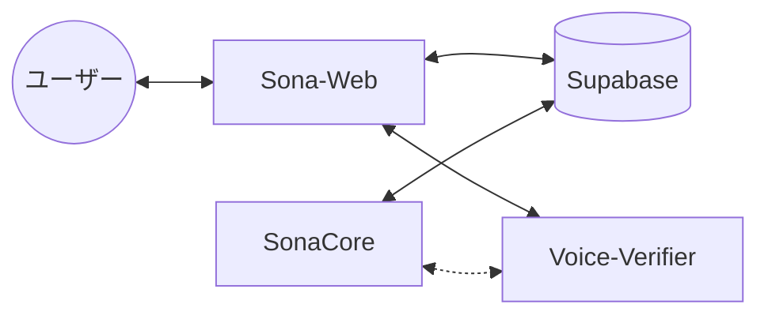
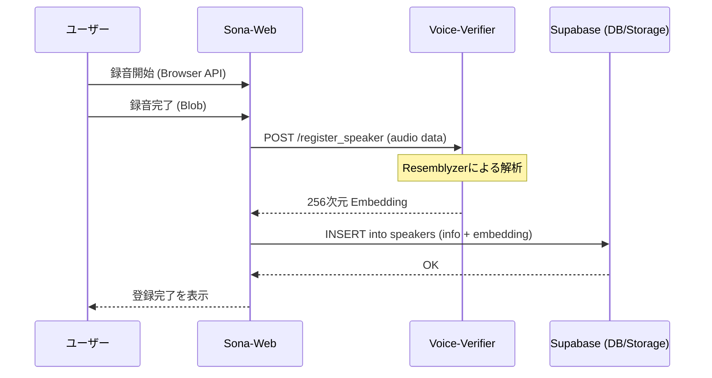
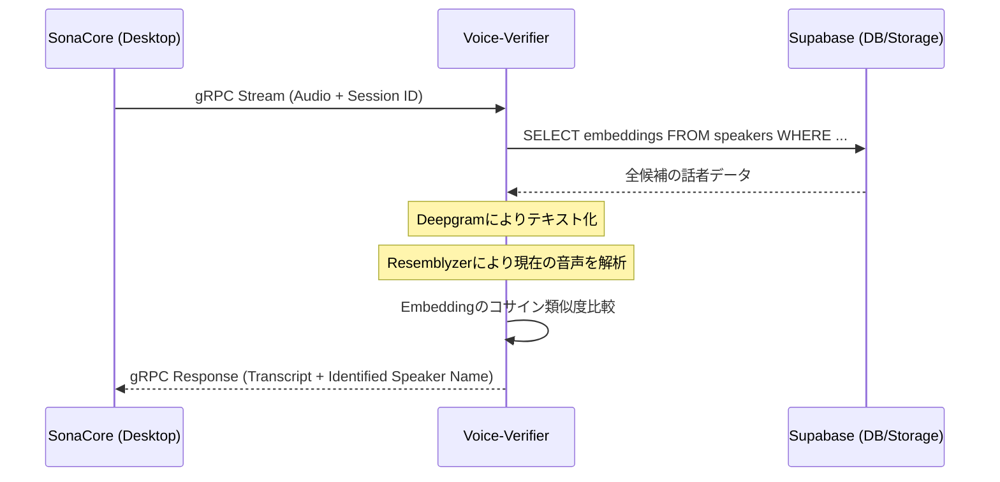

# Sona-Web 詳細設計書

Sona-Web は、Sona-Suite の管理・設定・運用のための Web ダッシュボードです。

## 1. システム構成

Sona-Web は以下のコンポーネントと連携して動作します。



- **Sona-Web**: Next.js (App Router), Tailwind CSS
- **Supabase**: 認証 (Auth), データベース (DB), ストレージ (Storage)
- **Voice-Verifier**: 話者識別・Embedding 生成エンジン
    - **生成装置**: 新規話者登録時に、音声から Embedding（声紋）を抽出。
    - **識別装置**: リアルタイムストリーミング中に、Supabase から取得した Embedding 群と現在の音声を比較し、話者を特定。
- **SonaCore**: デスクトップ用音声キャプチャ & 字幕クライアント

## 2. 外部設計

### 2.1 画面一覧
1. **ダッシュボード**: 全体のステータス、最近のセッション一覧。
2. **話者管理 (Speakers)**:
    - 組織・部署・話者のツリー表示。
    - 話者の新規登録（録音・Embedding生成連携）。
3. **エクセルテンプレート管理 (Excel Templates)**:
    - テンプレートファイルのアップロード。
    - セルマッピングの設定（GUIスプレッドシート）。
4. **セッション管理 (Sessions)**:
    - 会議の予約・開始、テンプレートおよび参加者の紐付け。
    - セッション ID の発行と QR コード表示（SonaCore 連携用）。
5. **会議ログ・シミュレーター (Logs & Simulator)**:
    - 過去の会議ログ（Markdown）の閲覧。
    - 別のテンプレートを適用した再出力シミュレーション。

### 2.2 主要ユーザーフロー：話者登録
1. ユーザーが氏名等を入力し「録音開始」をクリック。
2. ブラウザで音声を 5~10 秒間取得。
3. 音声データを `voice-verifier` の専用 API へ POST。
4. `voice-verifier` が Resemblyzer を使用して 256 次元の Embedding を生成して返す。
5. Sona-Web が Supabase の `speakers` テーブルに保存。

## 3. データベース設計 (Supabase)

### 3.1 テーブル定義

#### `organizations` (組織)
| カラム名 | 型 | 説明 |
| :--- | :--- | :--- |
| `id` | UUID | PK |
| `name` | TEXT | 組織名 |
| `created_at` | TIMESTAMPTZ | 作成日時 |

#### `speakers` (話者)
| カラム名 | 型 | 説明 |
| :--- | :--- | :--- |
| `id` | UUID | PK |
| `org_id` | UUID | FK -> organizations.id |
| `department` | TEXT | 部署名 |
| `name` | TEXT | 氏名 |
| `embedding` | VECTOR(256) | Resemblyzer の声紋データ |
| `created_at` | TIMESTAMPTZ | 作成日時 |

> [!IMPORTANT]
> `embedding` の次元数は、`voice-verifier` の Resemblyzer モデルに合わせて **256** とします。

#### `excel_templates` (エクセルテンプレート)
| カラム名 | 型 | 説明 |
| :--- | :--- | :--- |
| `id` | UUID | PK |
| `name` | TEXT | テンプレート名 |
| `file_path` | TEXT | Supabase Storage 内のファイルパス |
| `mapping_json` | JSONB | セル座標、書式、挿入ロジックの定義 |
| `created_at` | TIMESTAMPTZ | 作成日時 |

#### `sessions` (セッション管理)
| カラム名 | 型 | 説明 |
| :--- | :--- | :--- |
| `id` | UUID | PK |
| `title` | TEXT | 会議タイトル |
| `template_id` | UUID | FK -> excel_templates.id |
| `participant_ids` | UUID[] | `speakers.id` のリスト |
| `status` | TEXT | `pending`, `active`, `completed` |
| `created_at` | TIMESTAMPTZ | 作成日時 |

## 4. API・通信設計

### 4.1 Voice-Verifier 登録用 API (REST)
Sona-Web から話者登録を行うためのインターフェースです。

- **Endpoint**: `POST /register_speaker`
- **Request (Multipart/form-data)**:
    - `audio`: WAV/MP3 形式のボイスサンプル
- **Response (JSON)**:
    - `embedding`: 256 次元の数値配列

### 4.2 連携シーケンス

#### ① 話者登録 (Speaker Registration)
Sona-Web で直接音声を録音し、Embedding を生成・保存する流れです。



#### ② セッション開始 & リアルタイム話者識別
セッション中、Voice-Verifier が Supabase のデータを使用して話者を特定する流れです。



## 5. 開発環境・ディレクトリ構成

### 5.1 ディレクトリの役割定義

```text
/sona-web
├── src/
│   ├── app/           # App Router (Pages, Layouts)
│   ├── components/    # 再利用可能なUIコンポーネント
│   ├── hooks/         # カスタムフック
│   │   ├── useSupabase.ts # DB操作, 認証, Realtimeサブリプションの管理
│   │   └── useAudio.ts    # ブラウザマイク操作, 録音Blob生成, レベルメーター
│   ├── lib/           # 外部ライブラリ設定 (supabase-client 等)
│   ├── services/      # Voice-Verifier API 等の外部通信ロジック
│   └── types/         # TypeScript 型定義 (Protobufからの生成物含む)
├── protos/shared/     # [Submodule] Sona-Protobuf (共通通信定義)
├── supabase/
│   ├── migrations/    # SQLマイグレーションファイル (DBスキーマのバージョン管理)
│   └── seed.sql       # 開発用初期データ
├── Dockerfile         # Sona-Web 本体の Docker イメージ定義
├── docker-compose.yml # 開発スタック全体のオーケストレーション
└── tailwind.config.js
```

#### ディレクトリの責務詳細
- **hooks/useAudio.ts**:
    - ブラウザの `MediaRecorder` API を抽象化。
    - 話者登録時の 5~10 秒の録音制御、WAV形式への変換、音量可視化データの提供を担当。
- **hooks/useSupabase.ts**:
    - 会議ログのリアルタイム更新（Supabase Realtime）や、セッション状態の監視を担当。
- **protos/shared/**:
    - `Sona-Protobuf` リポジトリを Git Submodule として配置。
    - SonaCore (Rust) や Voice-Verifier (Python) と**全く同じ `.proto` ファイル**を参照することで、型定義の不一致を防ぐ。

### 5.2 データベース管理 (Migration)
DB変更は全てマイグレーションファイルで管理します。

1. **変更の作成**: `supabase/migrations/<timestamp>_init.sql` のように、SQLファイルを追加。
2. **ローカル適用**: `supabase migration up` (Supabase CLI) にて適用。
3. **コード反映**: 変更後は `supabase gen types typescript` にて、TypeScript 型定義を自動更新。

### 5.3 Docker 開発環境
Docker を使用することで、Next.js と周辺環境を統一します。

- **sona-web コンテナ**: Next.js デバッグサーバーが動作。
- **supabase-local (オプション)**: 必要に応じてローカルで Supabase スタックを起動し、インターネット接続なしでも開発可能な構成。

## 6. インターフェース定義の自動化

Sona-Suite では、複数の言語（TypeScript, Python, Rust）とプロトコル（gRPC, REST, PostgreSQL）が混在するため、**手動での型定義禁止**を原則とし、以下のツールチェーンでインターフェースを自動生成します。

### 6.1 全体像 (Source of Truth)

| 通信種別 | Source of Truth | 生成先 (Next.js) | 使用ツール |
| :--- | :--- | :--- | :--- |
| **Streaming (gRPC)** | `audio_service.proto` | `src/types/pb/*` | `Connect-ES` |
| **Management (REST)** | `Voice-Verifier` (FastAPI) | `src/services/api/*` | `Orval` (OpenAPI) |
| **Database** | Supabase Schema | `src/types/database.ts` | `Supabase CLI` |

### 6.2 各ツールの役割と選定理由

#### ① Connect-ES (gRPC用)
- **選定理由**: ブラウザから gRPC を直接扱うためのモダンなツールチェーン。Envoy などのプロキシなしで HTTP/1.1 上で動作する `Connect` プロトコルをサポートしており、Next.js との相性が非常に良い。
- **ワークフロー**:
    1. `Sona-Protobuf` 内の `.proto` を編集。
    2. `buf generate` を実行。
    3. `src/types/pb` に型安全なクライアントが生成される。

#### ② Orval (REST用)
- **選定理由**: FastAPI が自動生成する `openapi.json` を入力とし、TypeScript クライアントだけでなく、**TanStack Query (React Query) のカスタムフックまで自動生成**する。ダッシュボード開発の DX が大幅に向上する。
- **ワークフロー**:
    1. `Voice-Verifier` (FastAPI) でエンドポイントを定義。
    2. `http://localhost:8000/openapi.json` からスペックを取得。
    3. `orval` を実行。
    4. `useRegisterSpeakerMutation()` 等のフックが即座に利用可能になる。

#### ③ Supabase CLI (DB用)
- **ワークフロー**:
    1. `supabase/migrations` に SQL を記述。
    2. `supabase db push` でスキーマ更新。
    3. `supabase gen types typescript` で TS 型定義を更新。

### 6.3 開発ワークフロー

インターフェースに変更を加える際は、以下の「生成コマンド」を叩くことでプロジェクト全体の整合性を保ちます。

```bash
# 1. Protobuf 更新 (gRPC)
npx buf generate

# 2. REST API更新 (Voice-Verifier連携)
npx orval --config ./orval.config.js

# 3. DB型定義更新
supabase gen types typescript --local > src/types/database.ts
```
