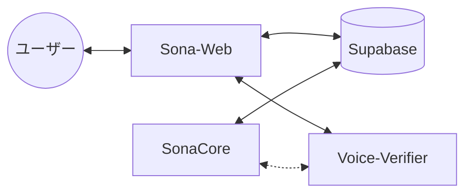
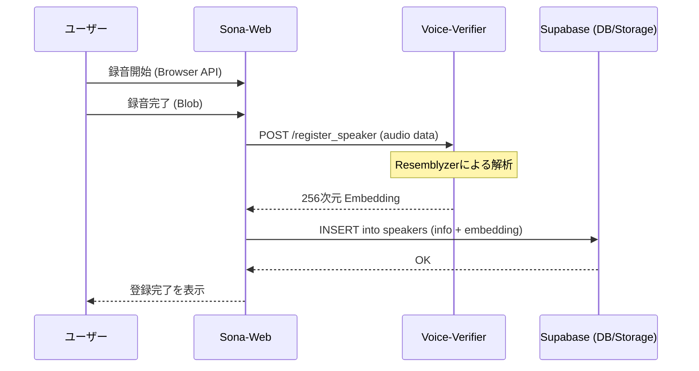
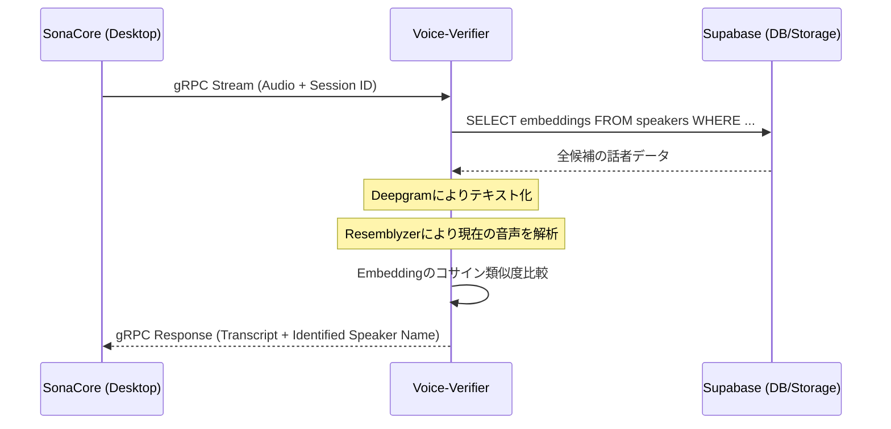

# Sona-Web 詳細設計書

Sona-Web は、Sona-Suite の管理・設定・運用のための Web ダッシュボードです。

## 1. システム構成

Sona-Web は以下のコンポーネントと連携して動作します。



- **Sona-Web**: Next.js (App Router), Tailwind CSS
- **Supabase**: 認証 (Auth), データベース (DB), ストレージ (Storage)
- **Voice-Verifier**: 話者識別・Embedding 生成エンジン
    - **生成装置**: 新規話者登録時に、音声から Embedding（声紋）を抽出。
    - **識別装置**: リアルタイムストリーミング中に、Supabase から取得した Embedding 群と現在の音声を比較し、話者を特定。
- **SonaCore**: デスクトップ用音声キャプチャ & 字幕クライアント

## 2. 外部設計

### 2.1 画面一覧
1. **ダッシュボード**: 全体のステータス、最近のセッション一覧。
2. **話者管理 (Speakers)**:
    - 組織・部署・話者のツリー表示。
    - 話者の新規登録（録音・Embedding生成連携）。
3. **エクセルテンプレート管理 (Excel Templates)**:
    - テンプレートファイルのアップロード。
    - セルマッピングの設定（GUIスプレッドシート）。
4. **セッション管理 (Sessions)**:
    - 会議の予約・開始、テンプレートおよび参加者の紐付け。
    - セッション ID の発行と QR コード表示（SonaCore 連携用）。
5. **会議ログ・シミュレーター (Logs & Simulator)**:
    - 過去の会議ログ（Markdown）の閲覧。
    - 別のテンプレートを適用した再出力シミュレーション。

### 2.2 主要ユーザーフロー：話者登録
1. ユーザーが氏名等を入力し「録音開始」をクリック。
2. ブラウザで音声を 5~10 秒間取得。
3. 音声データを `voice-verifier` の専用 API へ POST。
4. `voice-verifier` が Resemblyzer を使用して 256 次元の Embedding を生成して返す。
5. Sona-Web が Supabase の `speakers` テーブルに保存。

## 3. データベース設計 (Supabase)

### 3.1 テーブル定義

#### `organizations` (組織)
| カラム名 | 型 | 説明 |
| :--- | :--- | :--- |
| `id` | UUID | PK |
| `name` | TEXT | 組織名 |
| `created_at` | TIMESTAMPTZ | 作成日時 |

#### `speakers` (話者)
| カラム名 | 型 | 説明 |
| :--- | :--- | :--- |
| `id` | UUID | PK |
| `org_id` | UUID | FK -> organizations.id |
| `department` | TEXT | 部署名 |
| `name` | TEXT | 氏名 |
| `embedding` | VECTOR(256) | Resemblyzer の声紋データ |
| `created_at` | TIMESTAMPTZ | 作成日時 |

> [!IMPORTANT]
> `embedding` の次元数は、`voice-verifier` の Resemblyzer モデルに合わせて **256** とします。

#### `excel_templates` (エクセルテンプレート)
| カラム名 | 型 | 説明 |
| :--- | :--- | :--- |
| `id` | UUID | PK |
| `name` | TEXT | テンプレート名 |
| `file_path` | TEXT | Supabase Storage 内のファイルパス |
| `mapping_json` | JSONB | セル座標、書式、挿入ロジックの定義 |
| `created_at` | TIMESTAMPTZ | 作成日時 |

#### `sessions` (セッション管理)
| カラム名 | 型 | 説明 |
| :--- | :--- | :--- |
| `id` | UUID | PK |
| `title` | TEXT | 会議タイトル |
| `template_id` | UUID | FK -> excel_templates.id |
| `participant_ids` | UUID[] | `speakers.id` のリスト |
| `status` | TEXT | `pending`, `active`, `completed` |
| `created_at` | TIMESTAMPTZ | 作成日時 |

## 4. API・通信設計

### 4.1 Voice-Verifier 登録用 API (REST)
Sona-Web から話者登録を行うためのインターフェースです。

- **Endpoint**: `POST /register_speaker`
- **Request (Multipart/form-data)**:
    - `audio`: WAV/MP3 形式のボイスサンプル
- **Response (JSON)**:
    - `embedding`: 256 次元の数値配列

### 4.2 連携シーケンス

#### ① 話者登録 (Speaker Registration)
Sona-Web で直接音声を録音し、Embedding を生成・保存する流れです。



#### ② セッション開始 & リアルタイム話者識別
セッション中、Voice-Verifier が Supabase のデータを使用して話者を特定する流れです。



## 5. 推奨ディレクトリ構成 (Next.js)

```text
/sona-web
├── src/
│   ├── app/           # App Router
│   ├── components/    # 再利用可能コンポーネント
│   ├── hooks/         # カスタムフック (Supabase, Audio)
│   ├── lib/           # Supabase client, utils
│   ├── services/      # Voice-Verifier API client
│   └── types/         # TypeScript definitions
├── protos/shared/     # git submodule (Sona-Protobuf)
├── supabase/          # Migrations, config
└── tailwind.config.js
```
