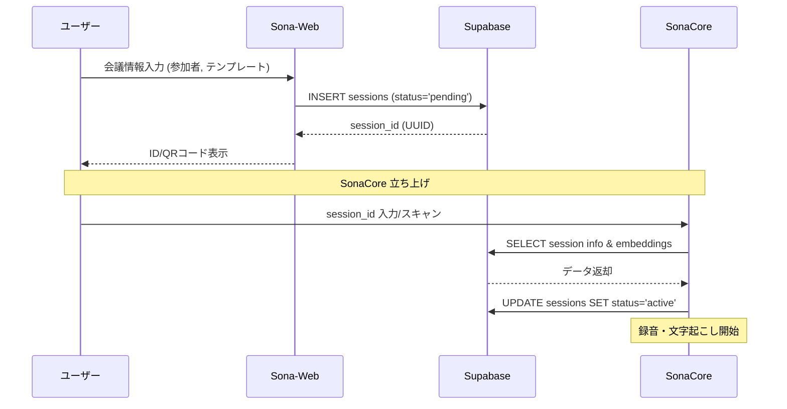

# セッション・コンソール機能 詳細設計

## 1. 概要
「セッション・コンソール」機能は、会議（セッション）のライフサイクルを管理する機能です。
会議の開始前に「誰が参加するのか（話者）」「どの出力テンプレートを使用するのか（エクセル）」を選択し、一意のセッション ID を発行します。発行された ID は SonaCore で読み込まれ、設定済みの環境で即座に録音・文字起こしを開始できる状態を提供します。

## 2. ユーザーフロー

### 2.1 セッションの新規作成・ID 発行
1.  **会議設定**: ユーザーが会議タイトルを入力。
2.  **参加者選択**: 登録済みの話者リスト（`speakers`）から、今回の会議に参加するメンバーを選択。
3.  **テンプレート選択**: アップロード済みのエクセルテンプレート（`excel_templates`）から、出力に使用するものを選択。
4.  **セッション発行**: 「セッション開始」ボタン押下により、DB に `pending` 状態でセッションを保存。
5.  **ID 取得**: 発行された UUID を画面に表示（または QR コード化）。

### 2.2 SonaCore との連携
1.  **ID 入力**: SonaCore クライアント側でセッション ID を入力、または QR コードをスキャン。
2.  **設定同期**: SonaCore が Supabase から以下の情報を自動取得。
    - 参加者の Embedding（声紋データ）
    - 使用するエクセルテンプレートの設定
3.  **録音開始**: ユーザーが SonaCore で録音を開始すると、セッションのステータスが `active` に遷移。

## 3. 画面設計（Sona-Web）

### 3.1 セッション一覧 (Console View)
- 過去および現在のセッションを一覧表示。
- ステータス（`pending`, `active`, `completed`）によるフィルタリング。
- 各行から「詳細表示」または「（pendingの場合）ID再表示」が可能。

### 3.2 セッション新規作成（発行）画面
- **入力フォーム**:
    - 会議名（Text）
    - 参加者（Multi-select: 組織・部署ツリーから選択）
    - テンプレート（Single-select: プレビュー付き）
- **アクション**:
    - 「セッション ID を発行して開始準備」ボタン

## 4. シーケンス図

## 5. データベース連携（再掲）

`sessions` テーブルを以下のように活用します。

| カラム名 | 役割 |
| :--- | :--- |
| `id` | セッション ID (UUID)。SonaCore との紐付けキー。 |
| `participant_ids` | 選択された話者の ID 配列。Voice-Verifier での識別対象を絞り込むために使用。 |
| `template_id` | 使用するエクセルの ID。出力時のフォーマットを決定。 |
| `status` | `pending` (準備中), `active` (進行中), `completed` (終了済)。 |
